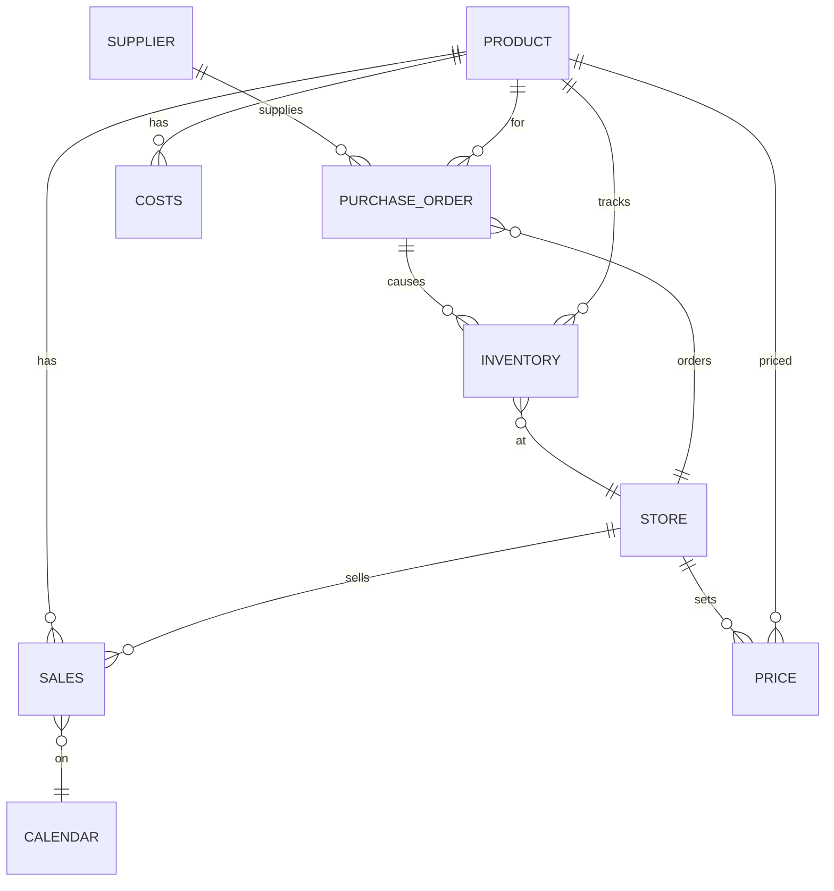
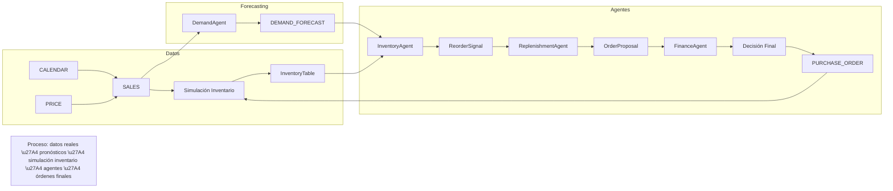

# Resumen Ejecutivo  
Este informe detalla la construcción de una **plataforma de simulación y agentes multi-agente** para optimizar la cadena de suministro, reabastecimiento y gestión financiera usando datos reales de Walmart (conjunto de datos M5). Se parte de datos históricos de ventas diarias por producto/tienda (M5), y se complementa con tablas operativas simuladas (inventarios, proveedores, costos, órdenes de compra) para crear un “gemelo digital” del proceso real. A partir de esta base se entrenan modelos de forecast de demanda y se implementa un sistema de agentes inteligentes (Demand Agent, Inventory Agent, Finance Agent, Supply Chain Agent) que colaboran para decidir cuándo y cuánto reaprovisionar de manera óptima. El informe abarca el inventario y descripción de los archivos M5, el diseño del modelo de datos SQL (tablas reales y simuladas con sus esquemas), el proceso ETL para transformar y normalizar los datos, la generación de inventario simulado, el diseño de los agentes y sus contratos de API, el pipeline de forecasting (modelos, métricas), la formulación de la optimización (función objetivo y restricciones), la simulación de órdenes con lead times, el módulo financiero (cálculo de costos y análisis presupuestal), la integración con LLM/agentes (RAG, logs, explainability), y finalmente un plan de desarrollo por fases con cronograma, diagramas mermaid y tablas comparativas de datasets alternativos. Se concluye con recomendaciones y checklist para la implementación. Este documento está orientado a ingenieros de IA y se apoya en fuentes oficiales como la documentación de Kaggle M5 y publicaciones relevantes.

## 1. Objetivos del Informe y Alcance  
- **Objetivo:** Definir cómo *convertir los datos reales del dataset M5 (Walmart)* en la base de datos de un simulador multi-agente que automatice el reabastecimiento, cadena de suministro y gestión financiera. Se mostrará cómo preparar los datos, diseñar tablas reales y simuladas, entrenar pronósticos, formular la optimización, y coordinar agentes inteligentes.  
- **Alcance:** Cubre desde la adquisición y limpieza de los archivos M5 hasta el diseño detallado de la arquitectura multi-agente y pipeline de Machine Learning/Optimización. No se aborda en detalle la interfaz de usuario ni despliegue en producción; tampoco se incluyen datos de proveedores reales (sólo parámetros simulados documentados). Se consideran horizontes de predicción de 7/14/28 días y simulaciones de stock diarias. Cualquier dato no especificado en M5 (lead times, costos, etc.) se declara explícitamente simulado o “no especificado” y se documenta su fuente o aproximación.

## 2. Inventario de Archivos M5 y Columnas Clave  

El **dataset M5 de Walmart** (competencia “M5 Forecasting – Accuracy” de Kaggle) provee datos de ventas diarias históricas por producto y tienda, así como calendario y precios. Los archivos principales (descargables desde Kaggle) son:  

- `calendar.csv` (~103 kB): Calendario de fechas con eventos. Columnas clave: `date` (fecha YYYY-MM-DD), `wm_yr_wk` (semana Walmart), `weekday`, `wday`, `month`, `year`, `d` (día relativo d_1,…), `event_name_1/2`, `event_type_1/2` (festivos/eventos especiales), `snap_CA/TX/WI` (banderas de SNAP en California, Texas, Wisconsin). Ejemplo de registros:  

  | date       | wm_yr_wk | weekday  | wday | month | year | d    | event_name_1   | event_type_1 | event_name_2 | event_type_2 | snap_CA | snap_TX | snap_WI |
  |------------|----------|----------|------|-------|------|------|----------------|--------------|--------------|--------------|---------|---------|---------|
  | 2011-01-29 | 11101    | Saturday | 1    | 1     | 2011 | d_1  | (vacío)        | (vacío)      | (vacío)      | (vacío)      | 0       | 0       | 0       |
  | 2011-02-06 | 11102    | Sunday   | 2    | 2     | 2011 | d_9  | SuperBowl      | Sporting     | (vacío)      | (vacío)      | 1       | 1       | 1       |
  *(Fuente: M5 calendar.csv)*  

- `sales_train_validation.csv` (~120 MB) y `sales_train_evaluation.csv` (~122 MB): Ventas diarias históricas por producto/tienda. Cada registro tiene: `id` (e.g. FOODS_1_001_CA_1), `item_id`, `dept_id`, `cat_id`, `store_id`, `state_id`, y luego columnas `d_1` … `d_N` con unidades vendidas por día. Por ejemplo, hasta `d_1913` o `d_1941` para datos de entrenamiento/validación. **Nota:** Kaggle originalmente entrega dos archivos: *validation* (hasta el día 1913) y *evaluation* (hasta el día 1941). Cada fila codifica un producto-tienda con ventas diarias; en total ~3.049 productos × 10 tiendas = ~30.490 series, equivalentes a decenas de millones de registros (en formato “wide” ocupa cientos de MB). Columnas clave (ejemplo):  

  `id`, `item_id`, `dept_id`, `cat_id`, `store_id`, `state_id`, `d_1`, `d_2`, …, `d_1941` (cada `d_#` es ventas del día). La tabla asociada de *productos* y *tiendas* se extrae de las columnas categóricas.  

- `sell_prices.csv` (~203 MB): Precios semanales de venta. Columnas: `store_id`, `item_id`, `wm_yr_wk` (semana en calendario), `sell_price`. Cada fila indica el precio unitario de un producto en una tienda durante la semana indicada. Ejemplo (no mostrado directamente, pero documentado por el conjunto M5): tiendas CA_1, etc. Este archivo permite conocer los precios aplicados a lo largo del tiempo en cada tienda.  

**Ruta de descarga:** los archivos se obtienen desde la competencia de Kaggle [M5 Forecasting – Accuracy](https://www.kaggle.com/competitions/m5-forecasting-accuracy/data). El total ocupa ~445 MB (como se ve en Hugging Face: archivos M5).  

## 3. Diseño del Modelo de Datos (SQL)  
Se propone un esquema SQL que combina tablas reales extraídas de M5 y tablas simuladas operativas. A continuación se definen las tablas principales:  

### Tablas de datos reales (extraídas de M5)  
- **PRODUCT** (`product_id` VARCHAR PK, `cat_id` VARCHAR, `dept_id` VARCHAR, `category` VARCHAR, `department` VARCHAR). Ejemplo: `product_id='FOODS_1_001'`, `cat_id='FOODS'`, `dept_id='1'`. *(Claves: PK en `product_id`)*  
- **STORE** (`store_id` VARCHAR PK, `state_id` VARCHAR, `state` VARCHAR). Ej: `store_id='CA_1'`, `state_id='CA'`.  
- **CALENDAR** (`date` DATE PK, `wm_yr_wk` INT, `weekday` VARCHAR, `wday` INT, `month` INT, `year` INT, `d` VARCHAR, `event_name_1` VARCHAR, `event_type_1` VARCHAR, `snap_CA` BOOLEAN, …). Ej: (`2011-02-06`, 11102, 'Sunday', 2, 2, 2011, 'd_9', 'SuperBowl', 'Sporting', 1,1,1). *(PK: `date`)*  
- **SALES** (`date` DATE, `store_id` VARCHAR, `product_id` VARCHAR, `units_sold` INT). Esta tabla se deriva haciendo “unpivot” de `sales_train_*`. Ejemplo: (`2016-05-20`, `CA_1`, `FOODS_1_001`, 12). *(Claves: PK compuesta (`date`,`store_id`,`product_id`); índices en `store_id`, `product_id`)*  
- **PRICE** (`wm_yr_wk` INT, `store_id` VARCHAR, `product_id` VARCHAR, `sell_price` FLOAT). Ej: (`11102`, `CA_1`, `FOODS_1_001`, 2.10). *(PK: (`wm_yr_wk`,`store_id`,`product_id`); índice por fecha/calendario para joins con SALES/CALENDAR)*  

Tabla de ejemplo con datos de ventas (**SALES**):  

| date       | store_id | product_id  | units_sold |
|------------|----------|-------------|------------|
| 2016-05-20 | CA_1     | FOODS_1_001 | 12         |
| 2016-05-20 | CA_1     | FOODS_1_002 |  5         |
| 2016-05-20 | TX_2     | FOODS_1_001 |  8         |
*(Ejemplo ilustrativo; los valores reales provienen de `sales_train_*.csv` tras convertir a formato largo.)*  

### Tablas operativas simuladas  
- **INVENTORY** (`date` DATE, `store_id` VARCHAR, `product_id` VARCHAR, `stock_on_hand` INT, `stock_reserved` INT, `stock_available` INT). Registra el inventario simulado diario. Ejemplo inicial: (`2016-05-20`, `CA_1`, `FOODS_1_001`, 150, 0, 150). *(PK compuesta (`date`,`store_id`,`product_id`))*  
- **SUPPLIER** (`supplier_id` VARCHAR PK, `supplier_name` VARCHAR, `product_id` VARCHAR, `lead_time_days` INT, `unit_cost` FLOAT, `min_order_qty` INT, `max_order_qty` INT). Ejemplo simulado: (`SUP_001`, 'ProveedorA', `FOODS_1_001`, 4, 2.10, 50, 5000). Define parámetros de abastecimiento por proveedor/producto.  
- **PURCHASE_ORDER** (`order_id` VARCHAR PK, `supplier_id` VARCHAR, `store_id` VARCHAR, `product_id` VARCHAR, `order_date` DATE, `quantity` INT, `expected_arrival` DATE, `actual_arrival` DATE, `status` VARCHAR, `unit_cost` FLOAT). Ejemplo: (`PO001`, `SUP_001`, `CA_1`, `FOODS_1_001`, 2016-05-20, 300, 2016-05-24, 2016-05-24, 'RECEIVED', 2.10). Registra las órdenes emitidas y llegadas.  
- **COSTS** (`product_id` VARCHAR PK, `holding_cost` FLOAT, `stockout_cost` FLOAT, `order_cost` FLOAT, `transport_cost` FLOAT). Parámetros financieros por producto. Ejemplo: (`FOODS_1_001`, 0.15, 4.50, 25.0, 40.0).  
- **DEMAND_FORECAST** (`store_id` VARCHAR, `product_id` VARCHAR, `forecast_date` DATE, `forecast_7d` INT, `forecast_14d` INT, `forecast_28d` INT, `model_version` VARCHAR). Ejemplo: (`CA_1`, `FOODS_1_001`, `2016-05-20`, 84, 176, 351, 'v1'). Contiene pronósticos agregados de demanda por horizonte (7, 14, 28 días). *(PK compuesta (`store_id`,`product_id`,`forecast_date`))*  

Estos esquemas facilitan consultas tipo *JOIN* (e.g. unir SALES con CALENDAR y PRICE para creación de características) y cálculos en cada agente. Los índices recomendados son clave: en SALES (`store_id`,`product_id`), en INVENTORY (`date`,`store_id`,`product_id`), en PURCHASE_ORDER (`status`).  

## 4. Proceso ETL Paso a Paso  
La transformación de los CSV de M5 al modelo SQL involucra: limpieza, normalización, pivote, carga en tablas SQL. A continuación un flujo de trabajo típico:

1. **Carga inicial:** Usando Pandas o SQL, importar `calendar.csv`, `sell_prices.csv` y `sales_train_*.csv`.  
2. **Limpieza:** Verificar formatos de fecha (`date`), tipos numéricos, datos faltantes. Por ejemplo, en `calendar.csv` normalizar fechas y categorizar eventos; en `sell_prices.csv` asegurar que cada combinación tienda-producto-semana tenga precio.  
3. **Pivote (wide→long):** Las tablas de ventas vienen en formato “wide” (columnas `d_1` a `d_1941`). Se usa `pandas.melt` para convertir a formato “long”:  
   ```python
   df_sales = pd.read_csv('sales_train_evaluation.csv')
   id_vars = ['id','item_id','dept_id','cat_id','store_id','state_id']
   df_long = pd.melt(df_sales, id_vars=id_vars, var_name='d', value_name='units_sold')
   ```  
   Este paso (unpivot) transforma cada fila de producto-tiendas en múltiples filas diarias. Luego se une con `calendar.csv` por la columna `d` para obtener la fecha real.  
4. **Generación de tablas base:**  
   - **PRODUCT y STORE:** Extraer las distintas claves de producto/tienda desde las columnas categóricas (e.g. unique `item_id`, `cat_id`, `store_id`).  
   - **SALES:** Crear tabla con columnas (`date`, `store_id`, `product_id`, `units_sold`) rellenando con los valores de `df_long`, mapeando `d` a `date` mediante `calendar`.  
   - **PRICE:** Cargar `sell_prices.csv` directo a la tabla PRICE (colocar el tipo `FLOAT` en `sell_price`).  
   - **CALENDAR:** Cargar `calendar.csv` (convertir `date` a DATE, los flags SNAP a booleanos).  
   SQL ejemplo (PostgreSQL) de inserción:  
   ```sql
   COPY CALENDAR(date, wm_yr_wk, weekday, wday, month, year, d, event_name_1, snap_CA)
   FROM '/path/calendar.csv' CSV HEADER;
   ```  
5. **Particionado:** Para rendimiento, particionar tablas grandes por fecha (e.g. particionar SALES e INVENTORY por año o mes). También indexar las columnas más consultadas.  
6. **Verificación:** Contar registros vs CSV originales (ej. total de unidades vendidas). Validar integridad referencial (cada registro en SALES debe tener PRODUCT y STORE válidos).  

Este proceso ETL, documentado con scripts reproducibles en Python/SQL, asegura que las tablas queden normalizadas y listas para el sistema de agentes. Las funciones *melt/pivot* de Pandas facilitan la reestructuración; luego se usan operaciones SQL estándar para joins, inserciones y agregaciones.

## 5. Generación de Inventario Simulado  
Como M5 no incluye niveles de inventario ni entregas, simulamos un **flujo de inventario** basado en las ventas reales. Por ejemplo:  

- **Stock inicial:** Para cada (tienda, producto) fijar un inventario inicial. Puede ser un valor arbitrario o basado en las ventas promedio (e.g. 10–20 días de stock).  
- **Recorridos diarios:** Suponiendo `stock_on_hand(t) = stock_on_hand(t-1) - units_sold(t-1) + recibiendo(t)`. Es decir, el inventario del día actual es el stock anterior, menos las ventas del día anterior, más cualquier recepción de pedidos (`recepciones`).  
- **Lead time y llegadas:** Si un agente emite una orden de compra en la fecha `order_date`, se asigna una fecha de llegada inicial `expected_arrival = order_date + lead_time`. Se puede simular variabilidad: p.ej. `actual_arrival = expected_arrival + retraso aleatorio`. Cuando llega la orden, el inventario se incrementa en la cantidad pedida.  
- **Fórmula simple:**  
  ```
  stock_on_hand(t) = max(0, stock_on_hand(t-1) - sales(t-1)) + arrivals(t)
  stock_available = stock_on_hand - stock_reserved
  ```  
  Aquí `stock_reserved` puede representar pedidos confirmados por clientes (simulado) o seguridad.  
- **Parámetros:** Elegir lead times (fijos o distribuidos, p.ej. Poisson) por proveedor, así como cantidades mínimas. Documentar cualquier supuesto: “Si no se especifica, lead_time = 5 días, stock_segur=10”.  

Ejemplo de código Python (pseudocódigo) para simular inventario diario:  
```python
stock = initial_stock
for date in fechas:
    vendas = sales_forecast[date]  # o ventas reales
    arrivals = sum(PurchaseOrders.arriving_on(date))
    stock = max(0, stock - vendas) + arrivals
    inventory_table.append((date, store_id, product_id, stock))
```  
En resumen, generamos la tabla INVENTORY rellenando día a día el stock disponible. Esta simulación permitirá que los agentes evalúen el estado del inventario actual, el “posición de inventario” (stock + pedidos en camino – demanda esperada), y decidir si hay riesgo de quiebre.

## 6. Diseño de Agentes  
Se proponen varios agentes que representan roles en la cadena de suministro. Cada agente tiene responsabilidades, entradas/salidas y puede invocar herramientas (modelos ML o funciones).  

- **Demand Agent (Agente de Demanda):** Predice la demanda futura.  
  - *Entrada:* Historial de ventas (`SALES`), precios (`PRICE`), calendario (`CALENDAR`), indicadores de promoción (ej. `snap_CA`, eventos).  
  - *Salida:* Pronóstico de demanda para próximos N días (p.ej. 7/14/28 días) para cada (tienda, producto). Se actualiza cada día/semanal.  
  - *Modelo:* Usa LightGBM/XGBoost (o Prophet, LSTM) con variables temporales, rezagos, promociones.  

- **Inventory Agent (Agente de Inventario):** Monitorea niveles.  
  - *Entrada:* Inventario actual (`INVENTORY`), demanda pronosticada (entrada del Demand Agent), plazos de entrega (`SUPPLIER.lead_time`).  
  - *Salida:* Indica si el inventario caerá por debajo del safety stock durante el lead time. Calcula “posición de inventario”:  
    ``` 
    IP = stock_on_hand + stock_reserved + sum(pedidos_pendientes) - demanda_durante_lead_time 
    ```  
  - *Acción:* Genera señal si `IP < reorder_point`.  

- **Replenishment Agent (Agente de Reposición):** Decide cuánto pedir.  
  - *Entrada:* La señal del Inventory Agent (necesidad de reabastecimiento), pronóstico de demanda, costos (`COSTS`), restricciones (presupuesto, MOQ, capacidad proveedor).  
  - *Salida:* Cantidad óptima a ordenar y selección de proveedor. Puede utilizar optimización matemática: por ejemplo, resolver un modelo MIP que *minimice costo_total = costo_ordenar + costo_mantener + costo_quiebre* sujeto a restricciones (presupuesto máximo, MOQ, lead time).  
  - *Ejemplo de decisión:* “Pedir 600 unidades de FOODS_1_001 al SUP_001”.  

- **Finance Agent (Agente Financiero):** Evalúa viabilidad económica.  
  - *Entrada:* Propuesta de orden del Replenishment Agent, costos unitarios (`unit_cost`), costos de transporte, presupuesto disponible en almacén.  
  - *Salida:* Aprobar/rechazar orden o ajustar cantidad. Por ejemplo, calcula `costo_total = q*unit_cost + fixed_order_cost + transporte + holding_cost*avg_inventory` y compara con presupuesto.  
  - *Pseudocódigo:*  
    ```
    if costo_total > presupuesto:
        sugerir reducir cantidad o rechazar
    else:
        aprobar
    ```  

- **Supply Chain Agent / Supervisor:** Coordina los anteriores y lleva el registro del estado global.  
  - *Función:* Orquestar la toma de decisiones. Invoca al Demand Agent para actualizar pronósticos, luego el Inventory Agent para chequear necesidades, luego el Replenishment Agent para generar órdenes y finalmente el Finance Agent para validarlas. Mantiene el flujo:  
    ```
           Supervisor
               │
     ┌─────────┼─────────┐
     ↓         ↓         ↓
  Demand    Inventory  Finance 
     │         │         │
     └─────────┼─────────┘
               ↓
    Replenishment Agent
               │
               ↓
    Acción final: Orden de compra o ajuste
    ```  
  - *Salida final:* Orden de compra confirmada o registro de política.  

Cada agente interactúa vía una API interna o base de datos compartida: e.g. Inventory Agent lee INVENTORY y DEMAND_FORECAST, y escribe señales en un buzón. El Supervisor lee todas las señales, selecciona la mejor decisión y actualiza PURCHASE_ORDER y CONTROL_LOG con la orden tomada.  

## 7. Pipeline de Forecasting  
El **pipeline de previsión** de demanda es crítico para el Demand Agent. Se sugiere lo siguiente:  

- **Características (features):** A partir de `SALES`, generar rezagos (ventas de 7, 14, 28 días atrás), medias móviles, indicadores de día de semana, mes, flag de eventos (del calendario), precios y promociones de la semana. Se puede usar *target encoding* para categorías de producto/tienda.  
- **Modelos sugeridos:** LightGBM y XGBoost para cada serie (capturan rápidamente patrones no lineales y escalables), Prophet o ARIMA para comparar. También modelos jerárquicos (capturan dependencia tienda-categoría-total) si fuera necesario. En M5 se han usado modelos ensamblados y también DL (LSTM).  
- **Entrenamiento:** Dividir datos en entrenamiento (hasta un cierto día) y validación (últimos 28 días). Se pueden entrenar modelos separados por categoría o grupo (referencia, los competidores de M5 usan agregaciones jerárquicas).  
- **Métricas:** Reportar MAE y RMSE a nivel de detalle, y WRMSSE (Weighted Root Mean Squared Scaled Error) a nivel agregado. Esta última es la métrica oficial de M5: pondera errores según volumen y niveles jerárquicos de la demanda. Un valor bajo de WRMSSE indica pronósticos consistentes con la estructura jerárquica.  
- **Código de entrenamiento (pseudo):**  
  ```python
  features = ['store_id','item_id','wday','month','snap','price', ...]
  X_train, y_train = crear_dataset(df_sales, window=28)
  model = lgb.LGBMRegressor(params)
  model.fit(X_train, y_train, eval_set=[(X_valid,y_valid)], early_stopping_rounds=50)
  forecast = model.predict(X_forecast)
  ```  
- **Validación:** Graficar residuales, comparar demanda real vs. pronóstico durante periodos recientes. Ajustar hiperparámetros con cross-validation.  

## 8. Módulo de Optimización  
Para decisiones de reaprovisionamiento numéricas, se formula un problema de programación lineal/entera:  

- **Variables de decisión:**  \( q_{i,s} \) = cantidad a pedir del producto \( i \) al proveedor \( s \).  
- **Función objetivo:** Minimizar costo total esperado:  
  \[
  \min \sum_{i,s} \Big( c_{i,s} \cdot q_{i,s} + h_i \cdot \text{avgInv}(q_{i,s}) + p_i \cdot \text{stockoutProb}(q_{i,s}) + f_{i,s} \Big)
  \]  
  Donde \(c_{i,s}\) = costo por unidad, \(h_i\) = costo de mantener inventario, \(p_i\) = costo de ruptura de stock, \(f_{i,s}\) = costo fijo de orden.  
- **Restricciones:**  
  - Presupuesto: \(\sum_{i,s} c_{i,s} q_{i,s} \le \text{presupuesto}\).  
  - Límites de proveedor: \(q_{i,s} \le \text{capacidad_s}\); \(q_{i,s} \ge \text{min_order_i}\).  
  - Demanda: sumatorias para cubrir demanda proyectada durante lead time con stock de seguridad.  
  - Integridad: \(q_{i,s}\) enteros, no negativos.  
- **Herramientas:** Google OR-Tools (CP-SAT o MIP) o PuLP para formular y resolver el modelo. Ejemplo simplificado en PuLP:  
  ```python
  import pulp
  prob = pulp.LpProblem('Replenishment', pulp.LpMinimize)
  q = pulp.LpVariable.dicts('qty', items, lowBound=0, cat='Integer')
  prob += pulp.lpSum(c[i]*q[i] + h[i]*avgInv(q[i]) for i in items)
  prob += pulp.lpSum(c[i]*q[i] for i in items) <= budget
  prob.solve()
  ```  
- **Ejemplo MIP:** Suponer 3 productos, 1 proveedor, minimiza \( \sum_i (2.1 q_i + 0.15 \times (q_i/2) + 4.5 \times stockoutProb(q_i))\) sujeto a presupuesto y demanda. El solver encuentra \(q\) óptimo.  

Este enfoque garantiza que la orden sugerida minimiza el costo total bajo las restricciones dadas. Se integra en el Replenishment Agent, que llama al solver con los parámetros actuales.

## 9. Simulador de Órdenes y Llegadas (Lead Times)  
Para cada orden de compra generada:  

- Asignar un **lead time** realista. Por ejemplo, `lead_time = base_lead_time + variabilidad`, donde `base_lead_time` viene de `SUPPLIER.lead_time_days`. Se puede modelar la variabilidad con una distribución (p.ej. `Poisson` o normal).  
- Calcular `expected_arrival = order_date + lead_time`. Simular posibles demoras:  
  ```
  actual_delay = np.random.choice([0,1,2], p=[0.7, 0.2, 0.1])
  actual_arrival = expected_arrival + actual_delay
  ```  
- Registrar en **PURCHASE_ORDER**: la fecha esperada vs. real. Cuando `actual_arrival` ocurre, generar la entrada correspondiente en INVENTORY (sumar `quantity` al stock).  
- Si hay retraso prolongado (`actual_delay > 0`), incrementar un contador de “atrasos” y notificar vía logs.  
- Ejemplo: `PO002` pedido el 2023-09-01 con lead_time=5, llega el 2023-09-06 si no hay demoras. Si se simula un delay=2, su `actual_arrival=2023-09-08`. Se actualiza INVENTORY en esa fecha.  

Este simulador de órdenes crea realismo (lead times no constantes) y permite al sistema manejar cancelaciones o stockouts temporales. Se registra todo en la tabla PURCHASE_ORDER para trazabilidad y análisis de performance logística.

## 10. Módulo Financiero  
El **Finance Agent** calcula los costos asociados y evalúa el impacto presupuestario:  

- **Costos calculados:**  
  - *Costo de compra:* \( q \times unit\_cost \).  
  - *Costo de transporte/flete:* fijo por orden (`transport_cost`) o variable.  
  - *Costo de almacenamiento (holding):* \(holding\_cost \times \text{stock promedio}\).  
  - *Costo de quiebre (stockout):* si la demanda excede el stock, se calcula \(shortage \times stockout\_cost\).  
- **Presupuesto:** Se asume un presupuesto disponible para órdenes. Por ejemplo, `$BUDGET = \$10000` por período.  
- **Reglas de aceptación:** Compara el costo total estimado de la orden propuesta vs presupuesto. Si excede, el Finance Agent devuelve `REJECTED` con explicación (e.g. “excede presupuesto”). Si está dentro, aprueba. En caso de rechazo, sugiere alternativa (reducir cantidad al máximo presupuestable).  
- **Ejemplo de cálculo:** Orden de 800 unidades a \$2.10 = \$1680 compra; transporte \$40; costo almacen: si permanecen 100 días (simplificado) = 100×0.15 = \$15; total ≈\$1735. Si presupuesto es \$1700, excede \$35, por lo que se rechaza o se pide 780 unidades.  

Este agente añade una capa de **viabilidad financiera** a las decisiones, asegurando que la política de reaprovisionamiento respete los límites presupuestarios. 

## 11. Integración de LLM/Agents (RAG, Logs, Explainability)  
Finalmente, se define cómo los agentes basados en LLM (ChatGPT u otro) interactúan con la base de datos y las herramientas:  

- **Arquitectura RAG:** Se alimenta a los agentes de un *Contexto de Conocimiento* (knowledge base) con política de inventarios, reglas de negocio y logs históricos. Los agentes pueden usar *Retrieval-Augmented Generation* para consultar estas reglas (p.ej. “¿Cuál es el stock de seguridad de FOODS_1_001?”). Esta base puede ser una colección de documentos o tablas consultables.  
- **Límites de contexto:** Un LLM como agente supervisor manejaría solo un conjunto resumido de datos (ej. KPIs críticos). Los cálculos numéricos (forecast, optimización) deben hacerse con modelos ML tradicionales o solvers; el LLM se usa para razonamiento y explicación. Por ejemplo, el agente supervisor puede “leer” un resumen del estado (inventario bajo, demanda alta) y “decir” en lenguaje claro la acción tomada: *“Ordeno 500 unidades de FOODS_1_001 al SUP_003 porque la demanda estimada supera el inventario”*.  
- **Logs y trazabilidad:** Cada interacción de agente genera un registro en un log central (por ejemplo, base de datos `AgentLog(fecha, agent_id, action, decision)`). Esto permite auditoría y mejora de políticas.  
- **Explicabilidad:** Se recomienda incluir un módulo de generación de explicaciones. Al tomar una acción, el sistema debe producir texto justificando la decisión (basado en métricas y reglas). E.g. *“He detectado que la posición de inventario caerá en 5 días, superando el stock de seguridad, por lo que solicito reposición”*.  
- **Cuándo usar LLM vs ML/Opt:** Se usa ML (y optimización) para cálculos precisos. El LLM-agent se usa como *cerebro de alto nivel* para integrar resultados y comunicarlos. Por ejemplo, el Demand Agent podría ser un prompt que formatee datos y llame a un modelo de ML; el Supply Chain Agent podría usar GPT-4 como controlador de flujo (invocando el solver interno y luego generando la respuesta final al usuario).  

Esta estrategia híbrida (herramientas + LLM) sigue el patrón *tool-augmented agents*. Por ejemplo, el agente supervisor dispondrá de un prompt que resume: inventario actual, pronóstico, costos, y luego “llamará” a la herramienta de optimización para decidir, formateando la respuesta del solver como un JSON de salida.  

## 12. Plan de Desarrollo por Fases (MVP)  
Se propone un plan en iteraciones semanales:  

| Fase / Semana | Actividades Principales                            | Entregables clave                  | Riesgos                         |
|---------------|----------------------------------------------------|------------------------------------|---------------------------------|
| **Semana 1**  | *Adquisición y exploración de datos M5.* <br>Descargar CSV M5; examinar tamaños, columnas.                    | Resumen de archivos M5 (esto).     | Datos corruptos, falta de espacio. |
| **Semana 2**  | *Diseño esquema SQL.* <br>Definir tablas PRODUCT, STORE, SALES, CALENDAR, PRICE. <br>Crear scripts SQL para DDL y carga (ETL básico). | Tablas SQL pobladas con datos (MVP).  | Inconsistencias en datos.        |
| **Semana 3**  | *Pipeline de Forecasting.* <br>Feature engineering; entrenar modelos (p.ej. LightGBM) para pronóstico de ventas. <br>Validación con MAE/RMSE/WRMSSE. | Notebook de forecasting, modelo entrenado. | Pronóstico con baja precisión.  |
| **Semana 4**  | *Simulación de inventario.* <br>Implementar generación de INVENTORY usando ventas reales. <br>Ajustar parámetros (lead time, stock de seguridad). | Tabla INVENTORY con  ejemplos plausibles. | Parámetros irreales.            |
| **Semana 5**  | *Módulo de optimización.* <br>Formular modelo MIP (por ejemplo, con PuLP). <br>Integrar solver en script Python. | Ejemplo de orden óptima vs. heurística. | Modelo lineal simplista.       |
| **Semana 6**  | *Integración de agentes (parte 1).* <br>Implementar Demand e Inventory Agents en código (pseudocódigo + herramientas). <br>Simulación de 1 producto/tienda. | Demo: un agente sugiere una orden.  | Coordinación agentes compleja.  |
| **Semana 7**  | *Integración de agentes (parte 2).* <br>Implementar Finance y Supervisor Agents. Añadir módulo RAG básico (fallback a reglas documentadas). | Demo completo: ciclo de decisión.  | LLM con información insuficiente. |
| **Semana 8**  | *Validación & Dashboard.* <br>Pruebas end-to-end; cálculo de métricas de rendimiento. <br>Construir visualizaciones (inventario vs demanda, órdenes, costos). | Panel de control prototipo y reporte final. | Bugs de integración.           |

Este cronograma es aproximado y se puede ajustar según recursos (por ejemplo, contar con 1–2 Data Engineers y 1 ML Engineer). Los riesgos incluyen calidad de datos M5, complejidad de agentes LLM, y necesidad de afinar parámetros de simulación.  

## 13. Tablas Comparativas y Diagramas  

**Tabla comparativa de datasets alternativos:** Además de M5 real, existen otros sets útiles (aunque con limitaciones):  

| Dataset                                  | Real/Sintético | Registros      | Contiene (`sales`,`inventory`,`precios`, etc.)   | Uso sugerido             |
|------------------------------------------|:--------------:|:--------------:|:-------------------------------------------------|--------------------------|
| **M5 (Kaggle Walmart)**                  | Real           | ~58M (long)    | Ventas diarias, precios, calendario/events        | Base principal (ventas). |
| **Retail Store Inventory (Kaggle)**      | Sintético      | ~73K diarios   | Ventas, inventario, clima, promociones, precios   | Reposición (datos fabricados). |
| **UCI Online Retail (UK)**               | Real           | 541.909 (trans)| Ventas de e-commerce (facturas), sin inventario   | Demanda/ventas por cliente (no supply). |
| **Other (p.ej. Instacart)**              | Sintético/real?| varía         | Pedidos por usuarios (no inventory ni tiendas)    | Ejemplos de granularidad, pero no aplicable directo. |

*(FUENTES: Documentos de Kaggle M5 y repositorios de datos públicos.)*

**Diagrama ER (simplificado):**  

*(Entidades principales: PRODUCT, STORE, SALES, CALENDAR, PRICE, INVENTORY, SUPPLIER, PURCHASE_ORDER, COSTS. Flechas indican relaciones de clave foránea.)*

**Flujo de datos y decisiones (Mermaid):**  

Este diagrama muestra la coordinación entre módulos: los **Datos reales** alimentan la *simulación de inventario* y los *agentes de forecast*; luego los agentes (Demanda, Inventario, Reposición, Finanzas) intercambian información para generar la orden final.  

## 14. Recomendaciones Finales y Checklist de Implementación  

- **Datos y documentos:** Confirmar fuentes oficiales para M5 (Kaggle). Mantener documentación de parámetros simulados (lead time, costos). Si falta información real, marcar como “no especificado”.  
- **Modularidad:** Construir los componentes (ETL, forecasting, simulador, agentes) como microservicios o módulos independientes con APIs claras.  
- **Verificación:** Al cargar datos M5, siempre verificar totales de ventas vs. informes y chequear anomalías (vacíos, outliers).  
- **Pruebas unitarias:** Para cada agente, escribir tests con casos conocidos (p.ej. si la demanda es cero, no pedir nada; si stock=0, disparar reorden).  
- **Escalabilidad:** Dado que M5 es grande, usar bases de datos eficientes (p.ej. Postgres o DuckDB) y algoritmos batch para transformar datos. Evitar cargar todo a memoria si no cabe.  
- **Métricas de éxito:** Definir umbrales de desempeño (p.ej. MAPE < 10% en forecasting, 0 stockouts en simulaciones controladas).  
- **Documentación:** Mantener un repositorio con notebooks o scripts de cada fase (ETL, forecasting, simulación, agentes). Cada script debe ser reproducible.  
- **Seguridad financiera:** Asegurarse que las reglas del Finance Agent sean configurables (p.ej. cambio de presupuesto en calendario fiscal).  
- **Monitoreo:** Implementar alertas (p. ej. “stock crítico”, “orden retrasada”).  
- **Iteración:** Comenzar con un MVP simple y luego iterar: primero pronóstico básico, luego refinar inventario, finalmente la optimización y agentes LLM.  

Con estos elementos, el equipo de IA dispondrá de una guía completa para convertir los datos históricos reales de Walmart M5 en un sistema de simulación multi-agente robusto, listo para enfrentar decisiones de cadena de suministro end-to-end. 

**Referencias principales:** Documentación oficial Kaggle M5, artículos y notebooks de Kaggle sobre M5, y ejemplos de pipelines de forecasting (LightGBM/XGBoost) y métricas de series temporales.  

------------------------------------------------------------------------------------------------------------------------------------------------------------------------------------------------------------------------------------------
# 📅 Día 1 — Entendimiento del dataset M5

**Fecha:** 22 de septiembre de 2026  
**Etapa:** Exploración y entendimiento de datos  
**Dataset:** M5 Forecasting — Walmart

## 1. Objetivo del día

El objetivo de esta primera jornada fue **familiarizarnos con la estructura y el contenido del dataset M5**, identificar qué información real está disponible y determinar qué componentes serán necesarios simular posteriormente para construir nuestro sistema de gestión de inventario, reabastecimiento y toma de decisiones multiagente.

Durante esta etapa se revisaron principalmente los archivos de **calendario, ventas y precios**, identificando sus principales variables y relaciones.

---

## 2. Exploración inicial de los datos

El dataset M5 proporciona información histórica de operaciones de Walmart relacionada principalmente con **ventas, productos, tiendas, precios y calendario**.

A partir de la exploración inicial se identificaron los siguientes componentes:

### 🗓️ Calendar

El archivo `calendar.csv` contiene la información temporal utilizada por Walmart para representar los días de operación del dataset.

Entre las variables disponibles se encuentran:

- Fecha.
- Día de la semana.
- Semana Walmart (`wm_yr_wk`).
- Mes y año.
- Identificador relativo del día (`d_1`, `d_2`, ...).
- Eventos especiales.
- Tipo de evento.
- Indicadores relacionados con SNAP para determinados estados.

El período histórico representado comienza en **2011 y se extiende hasta 2016**, permitiendo analizar patrones temporales, estacionalidad, días de la semana y posibles efectos asociados a eventos.

Esta información será especialmente relevante posteriormente para el **forecasting de demanda**, ya que permitirá incorporar variables temporales y eventos como características del modelo.

---

### 🛒 Sales

El archivo de ventas contiene el historial diario de unidades vendidas para diferentes combinaciones de **producto y tienda**.

Durante la exploración encontramos:

- **3.049 productos**
- **10 tiendas**
- **7 departamentos**
- **3 estados**
- **3 categorías principales**

Las categorías identificadas fueron:

```text
['HOBBIES', 'HOUSEHOLD', 'FOODS']
```

Las ventas se encuentran inicialmente en un formato **wide**, donde cada día está representado como una columna:

```text
id | item_id | dept_id | cat_id | store_id | state_id | d_1 | d_2 | d_3 | ... 
```

Por ejemplo, `d_1`, `d_2` y `d_3` representan las ventas correspondientes a diferentes días del período histórico.

Esta estructura deberá transformarse posteriormente a un formato **long**, más apropiado para análisis, modelamiento y almacenamiento:

```text
date | item_id | store_id | units_sold
```

La información de ventas será la principal fuente utilizada para construir el **modelo de pronóstico de demanda**.

---

### 💰 Prices

El archivo `sell_prices.csv` contiene información histórica sobre los precios de venta de los productos por tienda y semana.

Durante la exploración inicial se identificó:

- **Precio mínimo:** 0,01
- **Precio máximo:** 107,32
- **Precio promedio:** 4,41

Los precios podrán utilizarse posteriormente como una variable explicativa dentro del modelo de forecasting, permitiendo analizar posibles relaciones entre cambios de precio y comportamiento de la demanda.

---

## 3. Información disponible vs. información faltante

Una de las conclusiones más importantes de esta primera exploración fue identificar que **M5 no representa todo el proceso de Supply Chain**.

El dataset contiene información real sobre ventas, productos, tiendas, precios y calendario, pero no proporciona directamente información operacional como inventarios, proveedores u órdenes de compra.

Por esta razón, el proyecto se dividirá conceptualmente en tres fuentes de información.

### 🟢 Datos reales proporcionados por M5

- Productos.
- Tiendas.
- Ventas históricas.
- Precios de venta.
- Calendario.
- Eventos.
- Información de SNAP.

### 🟡 Datos que no proporciona M5 y deberán ser simulados

- Inventario actual.
- Historial de inventario.
- Proveedores.
- Lead times.
- Órdenes de compra.
- Costos de transporte.
- Costos de almacenamiento.
- Presupuesto.
- Costos asociados al quiebre de stock.
- Restricciones de capacidad de proveedores.

Estos datos no deben presentarse como información real de Walmart. Serán **variables simuladas y documentadas explícitamente** para construir el entorno de simulación.

### 🔵 Datos generados por los modelos

A partir de los datos reales y simulados, el sistema podrá generar información adicional mediante modelos de Machine Learning, optimización y simulación:

- Forecast de demanda.
- Riesgo de stockout.
- Punto de reorden.
- Stock de seguridad.
- Cantidad recomendada de compra.
- Selección de proveedor.
- Costo esperado.
- Impacto presupuestario.

---

## 4. Primera conclusión

La exploración del dataset permitió confirmar que **M5 es una buena base para representar la demanda real del sistema**, pero no es suficiente por sí solo para representar una cadena de suministro completa.

Por esta razón, la arquitectura del proyecto deberá combinar:

```text
                 DATOS REALES
                      │
                      ▼
              ┌───────────────┐
              │   Dataset M5  │
              └───────┬───────┘
                      │
          ┌───────────┼───────────┐
          ▼           ▼           ▼
       Ventas      Precios    Calendario
          │           │           │
          └───────────┼───────────┘
                      ▼
             Forecast de demanda
                      │
                      ▼
             ┌─────────────────┐
             │ Datos simulados │
             ├─────────────────┤
             │ Inventario      │
             │ Proveedores     │
             │ Lead Times      │
             │ Costos          │
             │ Órdenes         │
             └────────┬────────┘
                      ▼
             Sistema multiagente
                      │
                      ▼
              Decisiones de
              reabastecimiento
```

La separación entre **datos reales, datos simulados y resultados generados por los modelos** será fundamental para mantener la trazabilidad y evitar presentar como reales variables que fueron creadas específicamente para la simulación.

---

## 5. Resultado del Día 1

Al finalizar esta jornada se logró:

- [x] Descargar y cargar los archivos M5 en Google Colab.
- [x] Identificar la estructura general del dataset.
- [x] Analizar el archivo `calendar.csv`.
- [x] Analizar la estructura del archivo de ventas.
- [x] Identificar productos, tiendas, departamentos, estados y categorías.
- [x] Analizar el archivo `sell_prices.csv`.
- [x] Identificar las principales variables disponibles.
- [x] Identificar las variables que M5 no proporciona.
- [x] Diferenciar entre datos reales, datos simulados y datos generados por modelos.
- [ ] Transformar las ventas de formato **wide → long**.
- [ ] Construir las tablas normalizadas del sistema.
- [ ] Comenzar el análisis exploratorio de la demanda.

---

## 6. Próximo paso — Día 2

El siguiente objetivo será **estructurar y limpiar los datos para que puedan utilizarse posteriormente en el sistema**.

Las principales tareas serán:

1. Transformar las ventas de formato `wide` a `long`.
2. Relacionar `d_1`, `d_2`, etc. con las fechas reales mediante `calendar.csv`.
3. Crear las estructuras conceptuales de:
   - `PRODUCT`
   - `STORE`
   - `SALES`
   - `PRICE`
   - `CALENDAR`
4. Revisar valores nulos y duplicados.
5. Verificar la consistencia entre productos, tiendas, ventas y precios.
6. Preparar una primera versión limpia de los datos para el análisis exploratorio.

**Objetivo del Día 2:** pasar de simplemente *entender el dataset* a tener una **estructura de datos limpia y preparada para modelamiento**.

